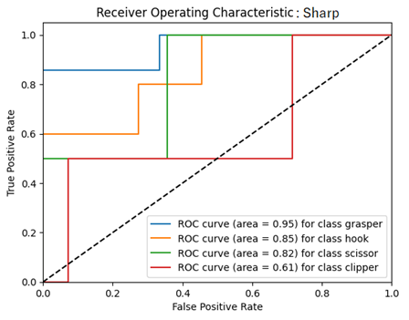
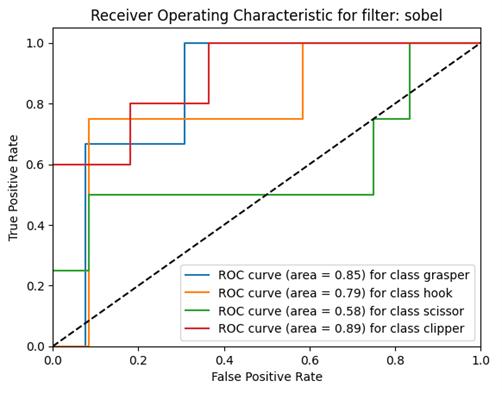
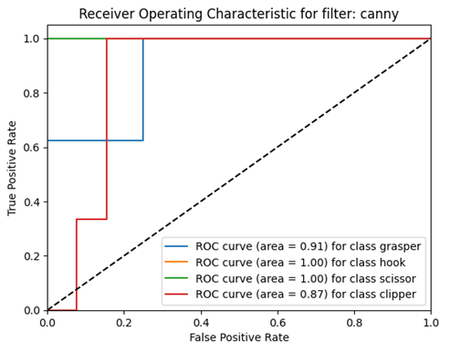
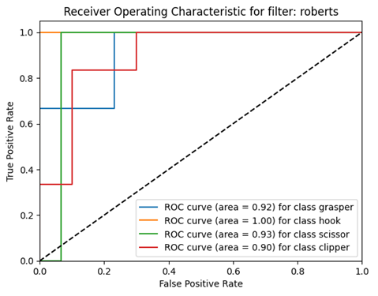
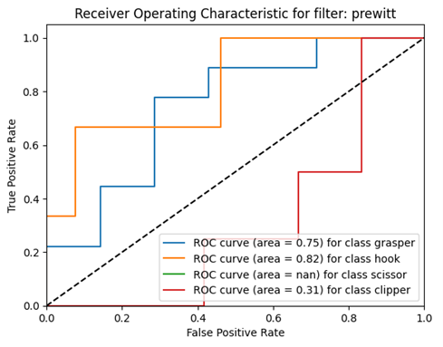

# Surgical Instrument Detection Using Deep Neural Networks and Image Preprocessing with Image Processing Filters in Laparoscopic Images

## Overview
Laparoscopic surgery is a minimally invasive procedure that relies heavily on visual guidance from a camera inserted into the patient's body. Accurate detection of surgical instruments in these images is critical for ensuring the safety and success of the operation. This project leverages the power of deep neural networks and advanced image preprocessing techniques to accurately detect and classify surgical instruments in laparoscopic images.

### Key Features
* **Deep Learning Models**: Utilizes state-of-the-art deep learning architectures such as VGG16, ResNet50, and ConvLSTM2D for robust and accurate detection of surgical instruments.
* **Image Preprocessing**: Applies various image processing filters to enhance the quality of laparoscopic images, improving the performance of detection algorithms.
* **Data Handling**: Efficiently manages and preprocesses large datasets of laparoscopic images, including splitting data into training, validation, and test sets using techniques like KFold and train_test_split from scikit-learn.
* **Performance Metrics**: Evaluates model performance using precision, recall, accuracy, and AUC-ROC metrics to ensure reliable and consistent results.
* **Visualization**: Provides tools to visualize detection results and performance metrics using Matplotlib, aiding in the interpretation and validation of the models.

### Libraries and Technologies
This project leverages a range of powerful libraries and frameworks, including:
* **OpenCV**: For image processing and computer vision tasks.
* **NumPy**: For numerical operations and data manipulation.
* **Scikit-Learn**: For data splitting and evaluation metrics.
* **TensorFlow**: For building and training deep learning models.
* **Matplotlib**: For plotting and visualization of results.
* **Tqdm**: For progress tracking during data processing and model training.
* **Argparse**: For parsing command-line arguments.
* **Requests**: For handling HTTP requests and downloading datasets.

### Goal
The primary goal of this project is to develop a reliable and efficient system for detecting surgical instruments in laparoscopic images, which can assist surgeons in real-time during minimally invasive procedures. By combining advanced deep learning techniques with robust image preprocessing, this project aims to enhance the accuracy and reliability of surgical instrument detection, ultimately contributing to safer and more effective surgical outcomes.


## Usage

__This is a guide to run this project.__

1. Clone this project using command below:

```bash
git clone https://github.com/mahdieslaminet/Surgical_Instrument_Detection_Using_Deep_Neural_Networks
```
2. Move these project to __Google Colab__ or _Jupyter Notebook_.
3. Install projects requirements using this command:
```bash
pip install -r requirements.txt
```
4. Run all the cells.


## Related works
Currently, deep learning-based machine vision methods are widely used in surgical tool detection. S. Wang et al. [22] proposed a multi-label classification method based on deep learning for surgical tool identification in laparoscopic surgery videos. This method combines VGGNet and GoogLeNet and combines the results of the models through cumulative learning to obtain the final result. Y. Wang et al. [23] and Y. Zhou et al. [24] proposed real-time surgical tool detection based on YOLOv4 and YOLOv5 models respectively, to assist surgeons in minimally invasive surgery. Kaidi Liu et al. [25] proposed an enhanced feature fusion network (EFFNet) for real-time surgical tool detection during surgery, which helps surgeons obtain more comprehensive visual information. A. Jin et al. [26] proposed using region-based convolutional neural networks for tracking and analyzing surgical tools in surgical videos and automatically evaluating the performance of surgeons. Kurmann et al. [27] proposed a method for identifying and estimating the status of surgical tools in minimally invasive surgery scenarios. This method first identifies the surgical tools based on RetinaNet and then estimates the 3D position of the surgical tools based on MASK R-CNN. These two network models use shared layers of convolutional neural networks, which may improve the accuracy of position estimation while maintaining the accuracy of tool detection.

To address the challenges mentioned in Figure 1, several studies have utilized the relationships between surgical tools and surgical phases and employed multi-task convolutional neural network architectures for simultaneous tool and phase identification [28,29]. Twinanda et al. introduced a baseline model called EndoNet [28]. EndoNet performs phase identification and surgical tool presence detection in laparoscopic cholecystectomy videos. Similarly, Jin et al. developed a multi-task deep learning framework but also defined a new correlation loss to leverage the tool-phase relationship. Abdulbaki Alshirbaji et al. utilized techniques such as re-sampling and weighted loss to cope with this issue [30]. Additionally, since surgical videos provide sequential data, recurrent neural networks (RCNNs) have been used to consider the temporal aspect of the surgical process and improve the classification of CNNs [31]. Mishra et al. proposed the use of Long Short-Term Memory (LSTM) networks to learn temporal dependencies in neighboring frames [32]. Similarly, Chen et al. examined the use of 3D convolutional neural networks to learn spatiotemporal features from short video clips [33]. Elhajj et al. employed a CNN-RNN pipeline for tool identification in surgical videos. Instead of training both networks end-to-end, they introduced a reinforcement strategy that uses weakly supervised classes to guide the training of CNNs to align with the output of RNNs [34]. Nwoye et al. proposed a deep learning framework trained using binary annotations to perform tool presence and tool tracking [31]. They used ConvLSTM (Convolutional LSTM) to learn spatiotemporal features in surgical videos. Recently, Wang et al. demonstrated the capability of using Graph Convolutional Networks (GCNs) to learn temporal relationships across consecutive frames [35]. Their method involved using video sequences of labeled frames and unlabeled close processes, and achieved significant improvements compared to reference methods.

In recent years, deep learning tools have been widely used for surgical instrument detection. Among these, Bajraktari et al. [36] proposed a method based on CNN neural network for detecting surgical instruments in limited surgeries. In another study, Ran et al. [37] suggested a method based on the YOLOv7x model for detecting surgical instruments in open and complex surgeries. Zheng [38] utilized the YOLOv7 model for detecting surgical instruments in limited and small surgeries. Bai [39] employed tracking and deep learning-based detection techniques for surgical instrument detection.

In the reviewed methods, it has been observed that few studies focus on image preprocessing and simplification for surgical tool detection. In this method, while utilizing the approach presented in [16], which is based on LSTM-CNN, edge detection has been used as a preprocessing step to improve the detection of surgical tools. The goal of this step is to eliminate noise and non-tool tissues and simplify the image data. Thus, edge information can enhance the phase transitions and movements in the LSTM-CNN model. The following section provides a detailed explanation of this process.

The main challenges of previous articles include not considering specific features and appropriate preprocessing for image analysis. To improve processing speed and meet the constraints of real-time processing, it seems necessary to reduce the volume of irrelevant information from the image and have image processing models focus only on regions where changes occur. Therefore, presenting methods for representing these changes is essential. In this article, the use of edge detection tools is proposed to address this issue. The reason for using edge information in the image is to eliminate irrelevant information and emphasize useful information.

## Results
This section presents the experimental results. First, the evaluation process is described, followed by the results. In this article, the results are presented based on multi-class scenarios, detection of surgical tool types based on different edge detection methods. For the multi-class scenario (4 classes), the detection of grasper, hook, scissor, and clipper tools is considered. In this article, to evaluate the proposed method based on the process of evaluating machine learning models, the data was divided into two categories: training and testing. The holdout method was used to split the data into training and testing sets. Therefore, 70% of the data was considered for training and 30% for testing.

Table 2 shows the results of the algorithms used based on evaluation metrics. According to Table 2, the Prewitt filter outperformed other methods in terms of performance. This indicates that the Prewitt filter extracts more useful information from the image and improves the model's performance by eliminating less useful information. In Figure 3, the ROC curve for the overall performance of the filters in tool detection is presented. It is observed that a higher area under the curve (AUC) in the ROC curve indicates better model performance. In this case, based on Table 2 and Figure 3, the Prewitt method had better performance in detecting the presence or absence of surgical tools in the image compared to other methods. The presence of a surgical tool refers to whether a specific surgical tool is present in the current frame or not, indicating a binary classification by the model. The last row in the table ranks each model, with lower numbers indicating better performance and ranking.


#### Table 2: Results of each edge detection method in detecting the presence or absence of objects

| Metric      | Prewitt | Roberts | Canny  | Sobel  | Sharp  |
|-------------|---------|---------|--------|--------|--------|
| Precision   | 90.28   | 90.15   | 87.15  | 90.05  | 89.01  |
| Recall      | 90.28   | 89.84   | 86.30  | 89.92  | 88.09  |
| Accuracy    | 90.15   | 89.80   | 86.27  | 89.90  | 88.05  |
| ROC AUC     | 0.9956  | 0.9952  | 0.9918 | 0.9954 | 0.9936 |
| Rank        | 1       | 2       | 4      | 3      | 5      |


#### Table 3: Average results in detecting the types of surgical tools present in the image

| Metric      | Prewitt | Roberts | Canny  | Sobel  | Sharp  |
|-------------|---------|---------|--------|--------|--------|
| Precision   | 46.26   | 43.78   | 48.43  | 43.94  | 54.30  |
| Recall      | 47.57   | 30.55   | 38.06  | 44.07  | 59.76  |
| Accuracy    | 47.57   | 30.55   | 38.06  | 44.07  | 59.76  |
| Rank        | 3       | 5       | 2      | 4      | 1      |

Figure 3: ROC curve for detecting surgical tools using different edge detection filters

The following results of the proposed method are presented based on the detection of surgical tool types. The results in this section are based on multi-class classification. Table 3 presents the average results for detecting surgical tools for each of the methods. In this case, the Sharp method showed better performance compared to other methods. Figures 4 to 8 show ROC curves for the Sharp, Sobel, Canny, Roberts, and Prewitt filters, respectively. A higher area under the ROC curve indicates better performance.

#### Figure 4: ROC curve for detecting the type of surgical instrument using the Sharp filter



#### Figure 5: ROC curve for detecting the type of surgical instrument using the Sobel filter



#### Figure 6: ROC curve for detecting the type of surgical instrument using the Canny filter



#### Figure 7: ROC curve for detecting the type of surgical instrument using the Roberts filter



#### Figure 8: ROC curve for detecting the type of surgical instrument using the Prewitt filter



For a better understanding of the AUC value for each class of images and the filter used in Table 4, the results related to the AUC of filters for each class are provided. In the row and column labeled "average" in Table 4, the average results for each class (average by column) and the average results for each filter (average by row) are presented.

## Results and Discussion
This paper focuses on the detection of surgical tools and their types using various edge detection filters combined with the model proposed in [16]. Therefore, the idea and innovation of the proposed method lie in utilizing edge detection filters to enhance important features and eliminate irrelevant information from the image. This helps the proposed method to detect tools more efficiently. Based on Table 2 and Figure 3, the proposed method using different edge detection filters was able to accurately detect the presence or absence of surgical tools in the image. Among the edge detection filters, the Prewitt filter showed better performance in detecting the presence of surgical tools in the image compared to other filters. Following the Prewitt filter, the Roberts, Sobel, Canny, and Sharp filters were ranked accordingly.

According to Table 3 and Figures 4 to 8, which represent the results for detecting the type of surgical tools, the results show relatively good performance. Among them, the Sharp method demonstrated better performance in detecting the type of surgical instrument compared to other filters. Following the Sharp filters, the Canny, Prewitt, Sobel, and Roberts filters were placed in subsequent positions. An interesting point is that in detecting the presence or absence of tools in the image, the Sharp method had the worst performance, and the Prewitt method, which initially detects the presence of tools in the image, is in third place in this case. In general, the results indicate that the use of different filters, depending on the type of information they capture, directly affects performance.

Based on the overall results of the two general experiments conducted, it can be said that the Prewitt filter preserves general image information, which can be suitable for image classification, while the Sharp filter provides more detailed information about image details, which can lead to better performance in detecting the type of objects present in the image. This conclusion can be extended to other filters as well.

#### Table 4: AUC value for each tool based on the filter used

| Filter/Class | Rank | Average | Clipper   | Scissor | Hook | Grasper |
|---------------|------|---------|-----------|---------|------|---------|
| Sharp         | 3    | 0.807   | 0.61      | 0.82    | 0.85 | 0.95    |
| Sobel         | 4    | 0.775   | 0.89      | 0.58    | 0.79 | 0.85    |
| Canny         | 1    | 0.945   | 0.87      | 1       | 1    | 0.91    |
| Robert        | 2    | 0.937   | 0.90      | 0.93    | 1    | 0.92    |
| Prewitt       | 5    | 0.465   | 0.31      | Nan (=0)| 0.82 | 0.75    |
| Average       | 0.876| 0.892   | 0.667     | 0.726   |      |         |
| Rank          | 2    | 1       | 4         | 3       |      |         |


## Links
* __Google Colab__
    1. [FinalsCodesN2.ipynb](https://drive.google.com/file/d/1rnHDAQNoAwFDNQHqHwxJZoSRyWuXzRwl/view?usp=sharing)
    2. [FinalsCodesN3.ipynb](https://drive.google.com/file/d/19ICCHK3BmT8l7eZ-Y9XJcElOWol3Q0kR/view?usp=sharing)
* [__Dataset link__](https://www.kaggle.com/datasets/swamysaxena09/cholec80)


## Licence
[__MIT License__](https://github.com/mahdieslaminet/Surgical_Instrument_Detection_Using_Deep_Neural_Networks/blob/main/LICENSE)


## Issues
[__Issues__](https://github.com/mahdieslaminet/Surgical_Instrument_Detection_Using_Deep_Neural_Networks/issues)

